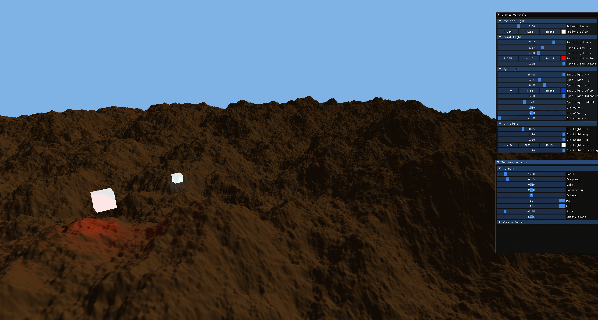
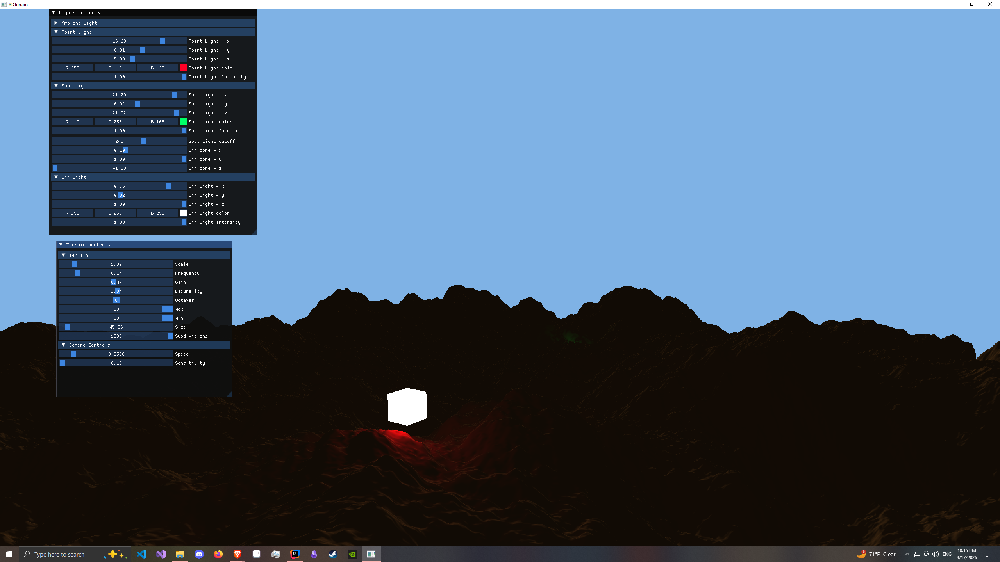
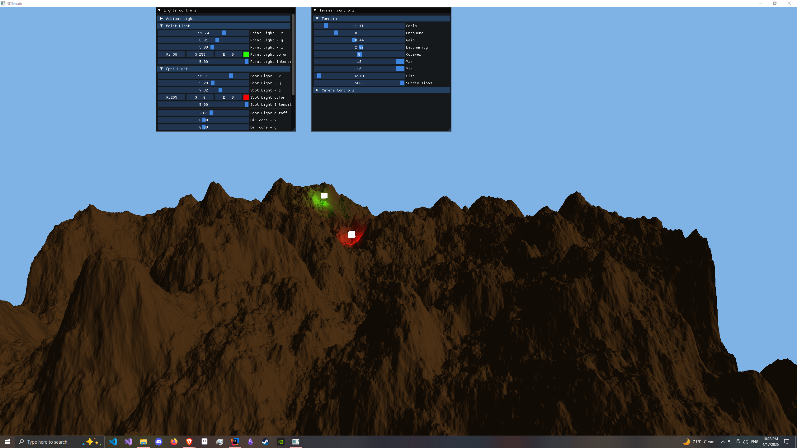
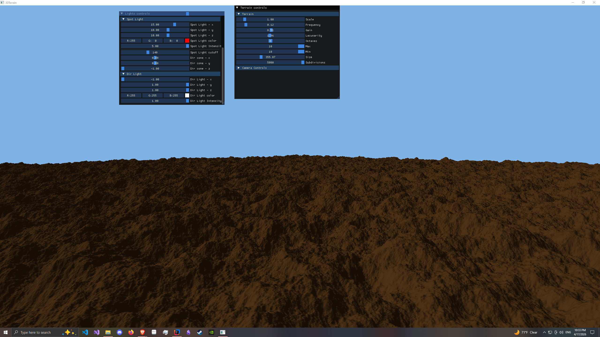

# Procedural Terrain Generation with LWJGL in Java

A Java-based 3D procedural terrain generator built using LWJGL (Lightweight Java Game Library) and OpenGL, leveraging Perlin noise with fractal Brownian motion for realistic terrain generation. This project supports customizable terrain through metric inputs and features an ImGUI interface for real-time parameter adjustments. The terrain is lit with a Plinn-Phong lighting model, with WASD movement and camera movement.

----

----

## Features
- **Procedural Terrain**: Generates 3D terrain using Perlin noise with fractal Brownian motion layering for natural-looking landscapes.
- **Customizable Input**: Supports real-time adjustable metrics (e.g., terrain height, scale) via an ImGUI interface.
- **Input System**:
    - WASD for camera movement.
    - Press right-click to move the camera with the mouse.
- **Tech Stack**:
    - Java 21
    - LWJGL for OpenGL rendering
    - Built with Gradle

## How to Run
1. Download the `3DTerrain.jar` from the **Releases** tab.
2. Make sure to install Java 21+
3. Run with: `java -jar 3DTerrain.jar`

## How to build 
1. Clone the repo: `git clone https://github.com/MrSander1/3DTerrainProject`
2. Run the project: `.\gradlew run`
3. Create your own JAR: `.\gradlew jar`

## Customization
If you are building, I recommend looking at Terrain Controls and Light Controls it is in these two classes where you will find the controls.
From here, you can change the minimum and maximums for most values. Play around with it, my values are simply optimized for the most simple usability, 
you might be able to find some more interesting terrain than what is provided by the set values if you do. 

## Pictures

