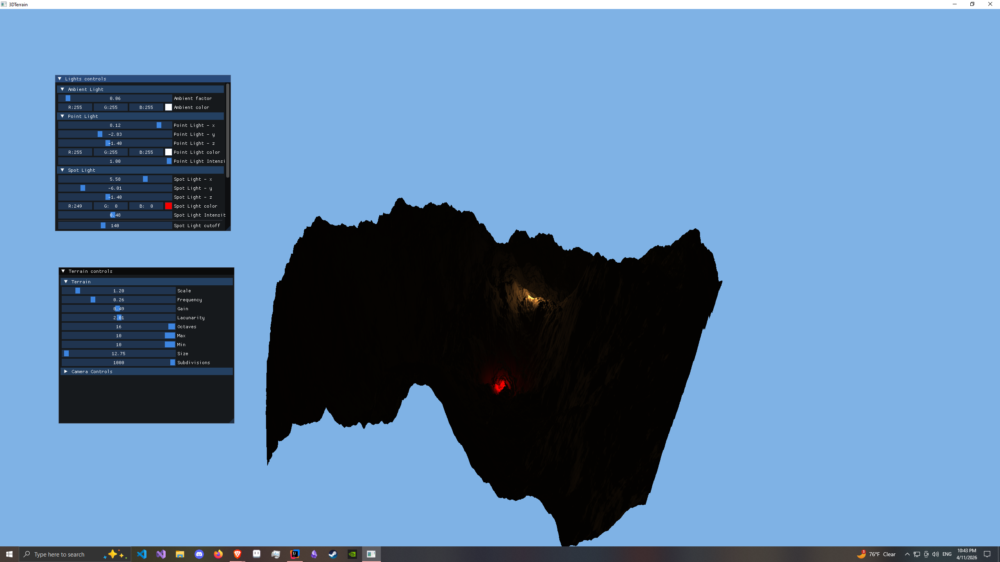

# Procedural Terrain Generation with LWJGL in Java

A Java-based 3D procedural terrain generator built using LWJGL (Lightweight Java Game Library) and OpenGL, leveraging Perlin noise with fractal Brownian motion for realistic terrain generation. This project supports customizable terrain through metric inputs and features an ImGUI interface for real-time parameter adjustments. The terrain is lit with a Plinn-Phong lighting model, with WASD movement and camera movement.

----

----

## Features
- **Procedural Terrain**: Generates 3D terrain using Perlin noise with fractal Brownian motion layering for natural-looking landscapes.
- **Customizable Input**: Supports real-time adjustable metrics (e.g., terrain height, scale) via an ImGUI interface.
- **Input System**:
    - WASD for camera movement.
    - Press right-click to move the camera with the mouse.
- **Tech Stack**:
    - Java 21
    - LWJGL for OpenGL rendering
    - Built with Gradle
